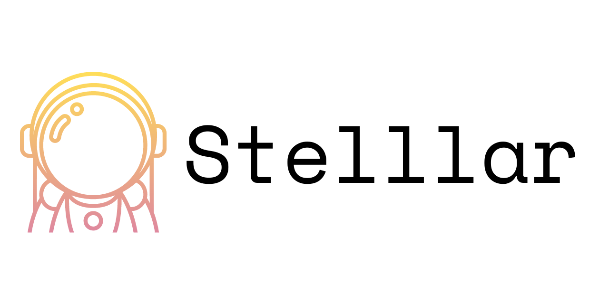

<p align="center">
    
</p>
<h5 align="center">Open Source Forum & Chat Platform for Anonymous Communities</h5>
<br/>

<div align="center">
  
</div>

## About

Stelllar is a open source forum and chat platform for anonymous communities.

## Tech Stack

#### Frontend (Web)

- [React](https://reactjs.org)
- [Next.js](https://nextjs.org)
- [Tailwind CSS](https://tailwindcss.com)
- [Apollo Client](https://github.com/apollographql/apollo-client)
- [GraphQL Code Generator](https://the-guild.dev/graphql/codegen)
- [NextAuth.js](https://next-auth.js.org)
- [Next SEO](https://github.com/garmeeh/next-seo)

#### Backend

- [NestJS](https://nestjs.com)
- [MikroORM](https://mikro-orm.io)
- [PostgreSQL](https://www.postgresql.org)
- [DataLoader](https://github.com/graphql/dataloader)

## Features

## Installation

#### Prerequisite

- Node.js 18
- Yarn
- Docker, Docker Compose

#### Start Database and Storage

Stelllar uses PostgreSQL, and AWS S3 for database and storage service respectively.

For development, instead of AWS S3, Stelllar uses [LocalStack](https://localstack.cloud/) which is a mocking of AWS
services.

To start PostgreSQL and LocalStack, enter the command below.

```shell
docker-compose up -d
```

## Configuration

## Contributing

Pull requests are welcome. For major changes, please open an issue first
to discuss what you would like to change.

Please make sure to update tests as appropriate.

## License

[GNU AGPLv3](https://choosealicense.com/licenses/agpl-3.0/)
